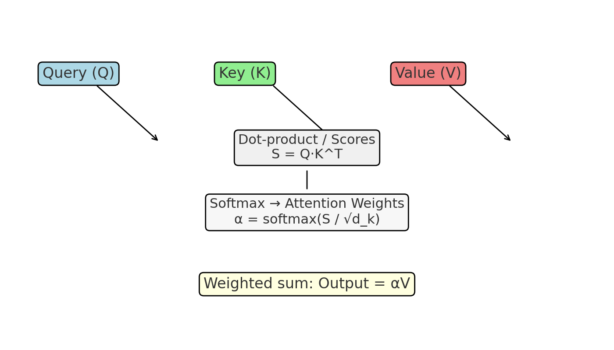

# Task 2 — Transformer Networks and Applications in Cybersecurity

## Overview (comprehensive description)

The Transformer is a neural network architecture introduced in 2017 that relies on self-attention mechanisms to process sequential data without recurrent or convolutional layers. At its core, the Transformer uses *multi-head self-attention* to let each position in the input sequence attend to (i.e., compute interactions with) every other position, producing context-aware representations. Inputs are first embedded and combined with positional encodings so the model retains information about token order. The encoder and decoder are composed of stacked layers: each encoder layer contains a multi-head self-attention module followed by a position-wise feed-forward network; decoders add cross-attention to incorporate encoder outputs. Layer normalization and residual connections are essential for stable training. The attention mechanism computes compatibility scores between **queries (Q)** and **keys (K)**, scales by the square root of the key dimension, applies softmax to obtain attention weights, and then aggregates the **values (V)** using those weights. This allows the network to dynamically focus on the most relevant parts of the sequence for each position. The Transformer family includes many variants (BERT, GPT, RoBERTa, T5) used widely in NLP and beyond.

Transformers have broad applicability in cybersecurity due to their strong ability to model patterns over sequences and to learn contextualized representations. They are used for tasks such as malware detection (by modeling API-call sequences or binary instruction sequences), network intrusion detection (by learning normal versus anomalous traffic patterns from packet or flow sequences), log analysis and anomaly detection (identifying suspicious patterns in system logs), phishing detection (classifying email or URL content), vulnerability discovery (assisting code analysis for vulnerable code patterns), and threat intelligence extraction (named entity recognition and relation extraction from reports). Transformers can also power code understanding tools that detect insecure coding practices and perform automated triage of security alerts by summarizing or prioritizing them. Their pretraining—on large corpora—followed by fine-tuning on labeled security data often leads to strong performance, especially when labeled data is scarce but unlabeled logs or codebases are abundant.

## Attention layer mechanism (visual explanation)

The attention layer computes scores between queries and keys, normalizes them with a softmax (optionally after scaling), and uses the resulting weights to form a weighted sum of the values. This enables the model to assign different importance to different positions dynamically. See the illustration below (saved as `attention_mechanism.png`).

## Positional encoding (visual explanation)

Since Transformers process input tokens in parallel, positional encodings inject information about the tokens' order. A common choice is the sinusoidal positional encoding where each dimension of the encoding corresponds to a sinusoid of different frequency. The encoding allows the model to learn relative and absolute positions and to generalize to longer sequences. See the sinusoidal positional encoding heatmap below (saved as `positional_encoding.png`).

## Practical considerations for cybersecurity applications

- **Data representation**: For binary or network data, convert raw inputs into token sequences or embeddings (e.g., byte n-grams, API-call tokens, protocol fields). Consider multimodal inputs (text + metadata + numeric features).
- **Pretraining & transfer learning**: Pretrain on large unlabeled corpora (e.g., code repositories, benign+malicious traffic) to learn useful priors; then fine-tune on downstream security tasks.
- **Explainability**: Attention weights can help interpret which parts of the input influenced decisions, aiding analysts in triage, though attention is not a perfect explanation metric.
- **Efficiency & scaling**: Transformers can be compute-intensive for long sequences; techniques like sparse attention, Linformer, Performer, or hierarchical models help scale to long logs or long binary sequences.
- **Adversarial robustness**: Security datasets are adversarial by nature; evaluate and harden models against evasion attacks (e.g., adversarially modified malware or obfuscated phishing emails).
- **Privacy & compliance**: When training on logs or sensitive telemetry, apply data minimization, anonymization, and follow legal constraints.

## Conclusion

Transformers are powerful and versatile for many cybersecurity tasks, offering strong sequence modeling, transfer learning, and interpretability opportunities that help detect, triage, and analyze threats. They require careful design choices—regarding input representation, computational efficiency, and robustness—to succeed in real-world security systems.

---

**Files included:**
- `task2.md` (this file)
- `attention_mechanism.png`
- `positional_encoding.png`

